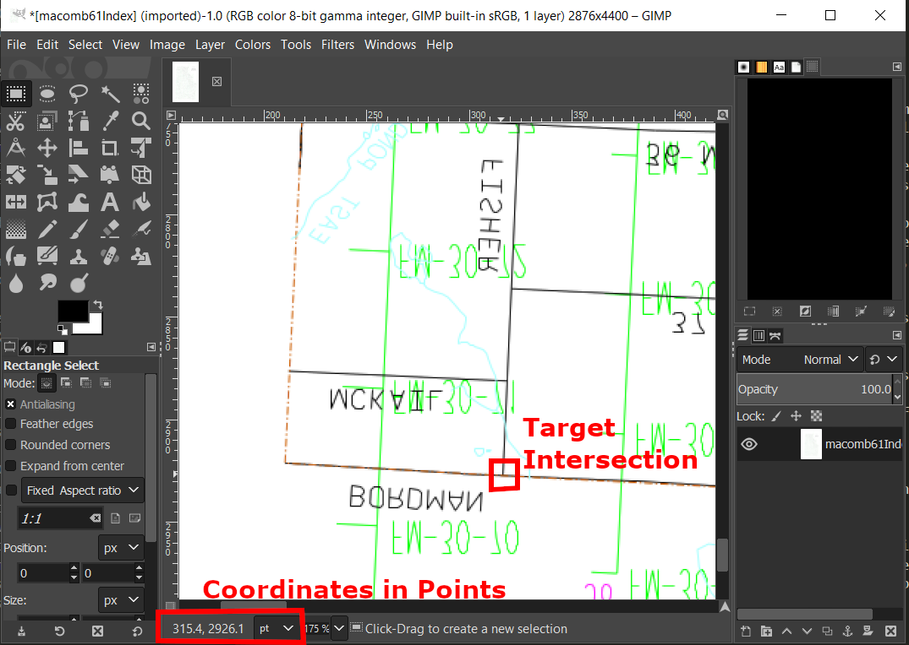

# SI 699 - DTE Aerial Photo Collection Digital Curation project
# Batch Processing Workflow Proof of Concept


## Purpose of Scripts

These scripts were written as part of a digital curation project for a mastery course at the University of Michigan School of Information. Our client, Wayne State University Libraries Digital Collections unit, had asked us to investigate the PDF files that comprise the [DTE Aerial Photo Collection](https://digital.library.wayne.edu/dte_aerial/). To assist with migrating the collection into the library's collection platform, we were asked look for ways to extract the images from the aerial photograph PDFs as image files, as well as for ways to recreate the location information contained with the index map PDFs in records for each individual image.

The Python scripts contained with this repository are designed to solve both of these tasks. `extract_using_pypdf.py` and `extract_using_poppler.py` are two scripts capable of extracting JPEG bytestreams and image metadata from the photo PDFS and writing the bytestreams to new files, as well as extracting document and link metadata from the index PDFs, in a target directory. `georeference_links.py` uses the link metadata from an index PDF generated by `extract_using_pypdf.py` to convert internal PDF coordinates into geocoordinates (latitude-longitude pairs). `process_batch.py` integrates the workflows laid out in the `extract_using_pypdf.py` and `georeference_links.py` scripts and combines the results of both into comprehensive records for each new JPEG file created. Each script -- its dependencies, its inputs and outputs, and how to run it -- is described in detail below.


## Script Descriptions


### process_batch.py

This script is designed to process the contents of a target directory in the DTE Aerial Collection, where there will be one index PDF and some number of image PDFs linked to in the index PDF. The script imports the `extract_using_pypdf.py` and `georeference_links.py` scripts described below and executes their workflow functions, ultimately creating new JPEG files for all image PDFs and various metadata files in JSON. One of the JSON files contains comprehensive records for the images, integrating descriptive, locational and technical metadata. The script's major added value is a matching algorithm that seeks to pair image metadata records with link records from the index PDF that have been georeferenced.

#### Use

To run the script, enter the following command at your command prompt of choice,  The command line options are described below.

`python process_batch.py [mode] [input path] [output path]`

There are two possible options for `[mode]`: `process` or `load`. `process` will run the extraction and georeferencing workflows. `load` will instead open the metadata files produced by the last `process` execution.

The value entered for `[input path]` should be a valid relative path from the current working directory to the target directory to process. If no value is entered for `input path` or `output path` (see below), the path used for the proof of concept ('input/pdf_files/part1/macomb/1961/') will be set.

The value entered for `[output path]` should be a valid relative path from the current working directory to the target directory to process. If no value is entered for `output path` (see below), the path used for the proof of concept ('output/') will be set.

#### Inputs

As `process_batch.py` also executes the workflows in `extract_using_pypdf.py` and `georeference_links.py`, it shares their inputs. See the descriptions below for details. While the workflow functions in those scripts write the data they collect to JSON files, they also scripts return the data collected during them directly, making it unnecessary to load their inputs as well.

In addition, the script loads data from two csv files: `manual_pairs.csv` and `files_without_links.csv`. In testing the proof of concept, we discovered that the link metadata in the collection's index PDFs can be incorrect or incomplete. We encountered two main issues: 1) sometimes links would point to an incorrect file, leading to duplicate instances of file identifiers referenced in links and image files without any links referenced them; and 2) sometimes an image file would exist without a link referencing because the link was never embedded in the file, even though the identifier is displayed on the index map.

To help resolve these issues, we built tests into the script that check for anomalies, including whether no or multiple matches are made, or whether there are links that have not been paired with an image. If multiple are found, the PDF Object ID Numbers for each link, the identifiers used by the internal PDF file structure, will be reported as well. Once the script user has explained the flags, they can be manually addressed by adding data to the manual_pairs.csv and files_without_links.csv. The format and source of the data for each of these files is explained below.

`manual_pairs.csv`

To correct the incorrect linking reported by the script, the  user will need to visually inspect the index PDF and determine the PDF coordinates of apparent link locations, which we recommend doing using the open source imaging edit tool [GIMP](https://www.gimp.org/) (a process described below). Using the coordinates and comparing them with those of the link records listed in the JSON document `[county]_[year] georeferenced_links.json`, the correct pairs of images and links (identified by the PDF Object ID Numbers) pairs can be determined. These matches can then be added in new rows to the manual_pairs.csv document, which must be encoded in UTF-8. The CSV file should have the following headers:

Index File Name	| Image Identifier | PDF Object ID Number
----------------|------------------|-------------------------

Index File Name will be the name of the index file included in the batch, including the file ending. The Image Identifier will be the string used in the image file name as identification, a combination of letters, dashes, and numbers. The PDF Object ID Number will be the internal numeric identifier for the PDF link object, included in the output of `extract_using_pypdf.py` and `georeference_links.py`.

To correct these, the script user will need to manually investigate the mismatches and enter the correct image file identifier and PDF Object ID Number matches in manual_pairs.csv.

`files_without_links.csv`

In cases where an image has no corresponding link record but its identifier appears in the index PDF, the locational details can be added to the image record by specifying the PDF coordinates, determined using GIMP, for an image file using files_without_link.csv. Once the script has the PDF coordinates, it converts them using functions from `georeference links` to geocoordinates. The CSV file should have the following headers:

Index File Name	| File Identifier	| GIMP X Coordinate	| GIMP Y Coordinate
----------------|-----------------|-------------------|------------------

Index File Name will be the name of the index file included in the batch, including the file ending. The Image Identifier will be the string used in the image file name as identification, a combination of letters, dashes, and numbers. The GIMP X Coordinate will be the X value to be converted to a latitude. The GIMP Y Coordinate will be the Y value to be converted to a longitude.

#### Outputs

In addition to the outputs produced by the `extract_using_pypdf.py` and `georeference_links.py` workflows, the `process_batch.py` script produces a comprehensive metadata file containing image records called `dte_aerial_[county]_[year]_image_records.json`, where `[county]` and `[year]` are the names of the county and year referenced in the index file name.

Each image record in the JSON contains the new JPEG file name and descriptive, technical, and preservation metadata gathered by the scripts. An example of the output is provided below.

```
{
    "Descriptive": {
        "Year": "1961",
        "Index County": "macomb",
        "File Identifier": "fm-11-100",
        "ArcGIS Current County": "Macomb County",
        "ArcGIS Geocoordinates": {
            "Latitude": -82.74493365978033,
            "Longitude": 42.77413107704377
        }
    },
    "Technical": {
        "Width": 5354,
        "Height": 5100,
        "ColorSpace": "DeviceGray",
        "BitsPerComponent": 8,
        "Filter": "DCTDecode"
    },
    "Preservation": {
        "Related Index File Name": "macomb61Index.pdf",
        "Match Details": {
            "Matching Method": "String matching on image file identifiers and file identifiers from links",
            "Link PDF Object ID Number": 631
        },
        "PDF Source Relative Path": "input\\pdf_files\\part1\\macomb\\1961\\fm-11-100.pdf",
        "Date and Time Created": "2019-4-21-15:21"
    },
    "File Name": "dte_aerial_fm-11-100.jpg"
}
```

#### Dependencies

Besides the dependencies passed on to it by extract_using_pypdf.py and georeference_links.py (see below), the script uses no additional third-party libraries. Local libraries referenced include the aforementioned scripts and additional function file, `misc_functions.py`, which contains helper functions utilized by multiple scripts. The `sys`, `json`, `csv`, and `copy` standard Python libraries are also used.


### extract_using_pypdf.py

Descripton of algorithm

#### Use

The script's Main Program runs the extraction workflow on the files in a test directory from the collection (input files are not provided).

#### Inputs

This script has no formal inputs. If the script itself is run and not imported, the program targets the directory specified in the Main Program for processing.

#### Outputs
#### Dependencies

This script uses [PyPDF2](https://pythonhosted.org/PyPDF2/), an open-source library for reading and writing PDF files. The entire codebase is available in a [GitHub repository](https://github.com/mstamy2/PyPDF2). The use of PyPDF2 and some script features (particularly the bytestream extraction using an object attribute) were inspired by [an answer by sylvain to a Stack Overflow question](https://stackoverflow.com/questions/2693820/extract-images-from-pdf-without-resampling-in-python/34116472#34116472).

### extract_using_poppler.py

Description of algorithm

#### Use
#### Inputs

This script has no formal inputs. If the script itself is run and not imported, the program targets the directory specified in the Main Program for processing.

#### Outputs

When run on a directory

#### Dependencies

`extract_using_poppler.py` makes use of another open source PDF rendering library and set of command line utilities called [Poppler](https://poppler.freedesktop.org/). We wrote this script to run on a Linux operating system, as that way Poppler is easier to access. Working with the codebase through Python required the use of an intermediary API, [PyGObject](https://pygobject.readthedocs.io/en/latest/index.html). The [Poppler-specific PyGObject documentation](https://lazka.github.io/pgi-docs/#Poppler-0.18) proved useful in writing this script. In addition, local libraries referenced include the shared function file, `misc_functions.py`. The `time`, `json` and `subprocess` standard Python libraries are also used. The `subprocess` module is used to run one of the Poppler command-line utilities, `pdfimages`.


### georeference_links.py

The algorithm in this workflow uses the PDF rendering coordinates for the links in the index map PDF to determine real-world geographic coordinates for the images represented by those links.  Using ArcGIS Desktop, we visually determined that the maps in the index PDFs use the Michigan State Plane coordinate system and are correctly oriented.  Due to Cartesian nature of the State Plane system and its local accuracy, we are able to use a linear transformation on the PDF rendering coordinates to calculate approximate geographic coordinates for the images.

In order to determine and apply the appropriate linear transformation, the algorithm uses the non-argument input of a CSV file called address_pairs.csv.  This file needs to contain information about two different points on the index map (any two different street intersections are fine).  The CSV contains one row for each different index PDF, with the following columns (with explanation below each):

| Index File Name | Address 1 | Address 1 GIMP X Coordinate | Address 1 GIMP Y Coordinate | Address 2 | Address 2 GIMP X Coordinate | Address 2 GIMP Y Coordinate
| --- | --- | --- | --- | --- | --- | --- |
| The name of the index PDF described | A single string describing intersection #2 (e.g. "Bordman Road and Fisher Road, Bruce Township, MI 48065") | The PDF rendering x coordinate for intesection #1 | The PDF rendering y coordinate of intersection #1 | A single string describing intersection #2 | The PDF rendering x coordinate of intersection #2 | The PDF rendering y coordinate of intersection #2 |

The PDF rendering coordinates can be found using GNU Image Manipulation Program (GIMP) or other image editing software such as Photoshop.  After importing the index PDF into GIMP, the PDF coordinates for the intersection can be determined by hovering the cursor over the intersection and noting the coordinates listed at the bottom of the window.  However,in a PDF (0,0) is located at the bottom left hand corner, increasing in the up and right directions, and in GIMP (0,0) is located at the top left hand corner, increasing in the down and right directions, the image must be flipped vertically before reading the coordinates.  Make sure these coordinates are displayed as points (pt) and not as pixels; PDF rendering is based on points and not pixels in order to preserve print output across systems.



The script takes these intersections and queries the ArcGIS API to find their geographic coordinates.  It then uses the known equivalence of the geographic coordinates and PDF coordinates from the two intersections to calculate the linear transformation used to determine geographic coordinates of the index PDF links.

#### Use

The script's Main Program runs the georeferencing workflow on a user-defined batch metadata file to generate a sample JSON file. The functions in this script are called by the primary workflow script, process_batch.py to georeference the images extracted by extract_using_pypdf.py.

#### Inputs

This script's primary function, `run_georeferencing_workflow()` takes as input the path to the metadata JSON file created by the `run_pypdf2_workflow()` function (also called by process_batch.py), the desired name of the output metadata file, and the path to the directory in which to create the output metadata file.  In order to run the workflow also requires a CSV called address_pairs.csv (described above) in the input folder.

#### Outputs

This script's primary function, `run_georeferencing_workflow()`, returns a data dictionary containing a) information used in the georeferncing process (two address pairs and the calculated conversion formula constants) and b) a dictionary for each image link in the index PDF containing its PDF object number, the image identifier it links to, the link's PDF coordinates, the image's calculated latitude and longitude, and the county the image is in.  The workflow function also writes this data to an output json file with name and location specified by the function's arguments.

#### Dependencies

[ArcGIS for Python Installation Guide](https://developers.arcgis.com/python/guide/install-and-set-up/)

## Script Use and Access
